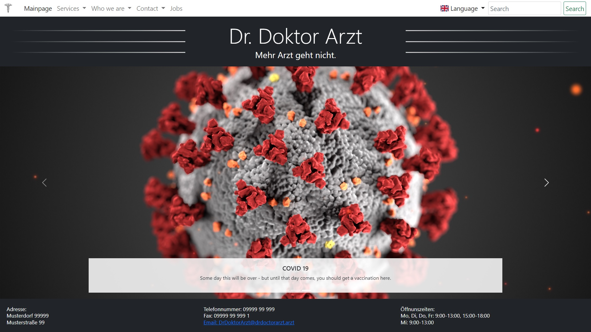

# Dr. Doktor Arzt

## Description
This is a webpage designed to present information about a medical facility like
a hospital or a doctors office. Of course it should be possible to alter the page to
present information not releated to medicine.

## Table of Contents
1. [Installation](#installation)
2. [Usage](#usage)
3. [Contributing](#contributing)
4. [Credits](#credits)
4. [License](#license)

## Installation

1. install Python
2. install Anaconda or similar
3. install npm
4. download repository
5. open console in repository folder
6. run `npm init`
7. run `pip install < requirements.txt`
8. start server using `run-prod.sh`

### Dependencies
* [Flask](https://rubyonrails.org/security/) for the backend,
  [install](https://flask.palletsprojects.com/en/1.1.x/installation/),
  [mini-example](https://flask.palletsprojects.com/en/1.1.x/quickstart/#a-minimal-application),
  [tutorial](https://blog.miguelgrinberg.com/post/the-flask-mega-tutorial-part-i-hello-world).
* [Jinja2](https://jinja.palletsprojects.com/en/2.11.x/) as template engine,
* [Flask-Babel](https://flask-babel.tkte.ch) for multiple language support,
  [Big-example](https://medium.com/@nicolas_84494/flask-create-a-multilingual-web-application-with-language-specific-urls-5d994344f5fd),
  [example](https://phrase.com/blog/posts/python-localization-flask-applications/).
* [Bootstrap](https://getbootstrap.com) for the frontend,
  [example-list](https://getbootstrap.com/docs/5.0/examples/),
  [modal](https://getbootstrap.com/docs/5.0/components/modal/#how-it-works),
  [colors](https://getbootstrap.com/docs/5.0/customize/color/).
* [Webpack](https://pypi.org/project/Flask-Webpack/) for bundeling,
  [example](https://medium.com/@sofiaroc.pt/integrating-webpack-4-with-a-backend-framework-4a0e630d2a03)
* [Flags](https://github.com/lipis/flag-icon-css) for language flags.
* [OpenStreetmap](https://wiki.openstreetmap.org/wiki/DE:OSM_mit_Leaflet/Vorbereitung) for map.
* [Leaflet](https://leafletjs.com/examples/quick-start/) for map.
* [cash-dom](https://github.com/fabiospampinato/cash) for dom manipulation.
* [axios](https://github.com/axios/axios)
* [sqlite](https://www.sqlite.org/index.html) for the database

## Usage
After installation it should be possible to run any of the shell scripts that are located in the
scripts folder.

* `run-prod.sh` Starts the flask server.
* `run-dev.sh` Starts the flask server in development mode. Additionally the language files are
recompiled.
* `clean.sh` Deletes all files created from flask compile.
* `update-lang.sh` Update all language files. Call this if you added language dependent content.

If starting the server was successful the page can be found via `localhost:5000` and should look
like this:

The database can be cleaned by running `create_db.py` in `app\database\`.

Adding new languages can be done by running
`pybabel init -i app/translations/messages.pot -d app/translations -l de`

## Contributing

I encourage you to contribute to this project, in form of bug reports, feature requests
or code additions. Although it is likely that your contribution will not be implemented.

Please check out the [contribution](docs/CONTRIBUTING.md) guide for guidelines about how to proceed
as well as a styleguide.

## Credits
Up until now there are no further contributors other than the repository creator.

## License
This project is licensed under the MIT License
